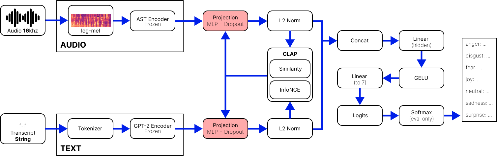

# TAMERS
**Transformer Audio–Text Multimodal Emotion Recognizer for Speech (TAMERS)** - a novel approach to Speech Emotion Recognition (SER).
> Still in active research!

## How to Run
After acquiring the model at [Releases](../../releases), evaluating said model is as simple as creating a `checkpoints` directory, placing the `.pt` model in there, and running `analyze.py`. For training your own model please reference the argument flags in `train.py` on how to optimize your training runs.
```
usage: train.py [-h] [--root ROOT] [--epochs EPOCHS] [--batch-size BATCH_SIZE] [--num-workers NUM_WORKERS] [--lr LR]
                [--weight-decay WEIGHT_DECAY] [--min-lr MIN_LR] [--max-weight-decay MAX_WEIGHT_DECAY]
                [--lr-decay-factor LR_DECAY_FACTOR] [--wd-growth-factor WD_GROWTH_FACTOR]
                [--hp-patience HP_PATIENCE] [--hp-tolerance HP_TOLERANCE] [--eval-frequency {epoch,step}]
                [--eval-every EVAL_EVERY] [--eval-batches EVAL_BATCHES] [--eval-shuffle] [--seed SEED]
                [--use-multi-gpu] [--save-path SAVE_PATH] [--fusion-shared-dim FUSION_SHARED_DIM]
                [--fusion-dropout FUSION_DROPOUT] [--fusion-hidden-mult FUSION_HIDDEN_MULT]
                [--fusion-classifier-depth FUSION_CLASSIFIER_DEPTH] [--grad-accum-steps GRAD_ACCUM_STEPS]
                [--prefetch-factor PREFETCH_FACTOR] [--pin-memory] [--no-pin-memory] [--no-amp]
                [--metrics-log METRICS_LOG] [--class-weight-gamma CLASS_WEIGHT_GAMMA]
                [--train-sampler {shuffle,weighted,interleaved}] [--interleave-period INTERLEAVE_PERIOD]
                [--log-eval-per-class] [--train-metrics-every TRAIN_METRICS_EVERY]
                [--train-metrics-batches TRAIN_METRICS_BATCHES] [--early-stop-patience EARLY_STOP_PATIENCE]
                [--early-stop-threshold EARLY_STOP_THRESHOLD] [--max-grad-norm MAX_GRAD_NORM]
                [--load-checkpoint LOAD_CHECKPOINT]
```

## Inspiration

I wanted to learn transformers and apply them to a current problem, so I explored **contrastive pretraining**, specifically **CLAP** (Contrastive Language–Audio Pretraining), on embeddings from a **ViT-style audio encoder (AST)** and an **autoregressive transformer** for text. Training custom encoders would take time, so I used **GPT-2** for text and a **pretrained AST** from **Hugging Face**.

## Architecture at a Glance

- Audio (WAV @16 kHz) -> log-mel spectrogram -> **AST encoder** -> audio embedding  
- Transcript (text) -> tokenizer -> **GPT-style encoder** -> text embedding  
- Audio/Text embeddings -> **projection to shared space** -> **L2-normalize** -> `z_a`, `z_t`  
- Similarity: `sim = z_a @ z_t.T * exp(logit_scale)` -> **InfoNCE contrastive loss** (align pairs)  
- Fuse: `[z_a ; z_t]` -> **classifier** -> emotion logits -> **cross-entropy**  
- **Total loss** = InfoNCE + Cross-Entropy  
- Encoders **frozen**; projection + classifier **trainable**  
- Labels: anger, disgust, fear, joy, neutral, sadness, surprise



## Training at a Glance

- **Data splits:** MELD `train` for training, `dev` (renamed `eval`) for tuning, `test` held out.  
- **Batching:** Collate builds log-mel features for AST and tokenized inputs for GPT-style text; pads/truncates and returns tensors.  
- **Frozen encoders:** AST and GPT-2 run in `eval()` with `no_grad()`. Only the fusion head trains.  
- **Forward pass:** Projections -> L2-normalize -> compute `sim = z_a @ z_t.T * exp(logit_scale)` and class `logits`.  
- **Loss:**  
  `total_loss = 0.5*(CE(sim, ids) + CE(sim.T, ids)) + CE(logits, y, weight=class_weights)`  
  (symmetric InfoNCE + cross-entropy; class weights optional).  
- **Optimizer/precision:** AdamW (`lr=5e-4`, `wd=1e-2`) + **AMP autocast** + **GradScaler**; gradient accumulation supported.  
- **Imbalance handling:** Shuffled or class-weighted sampler; optional interleaving; optional class-weight gamma flattening.  
- **Eval cadence:** By epoch or step; logs accuracy, per-class metrics, and confusion; saves best checkpoints.  
- **Adaptive HPs:** On eval-loss plateau -> decay LR, grow weight decay within bounds.  
- **Early stopping:** Optional patience/threshold.

## Remarks

- This **iteration** is a proof of concept showing the architecture works, with **53.26% accuracy** on MELD (7-class). [Releases](../../releases) 
- For rapid iteration I used GitHub Copilot alongside my own DL knowledge to try alternatives (e.g., sampling schemes, adding/removing MLPs) and validate training behavior.  
- MELD is relatively small (~13k utterances) and **class-imbalanced** (heavy **neutral**, sparse **disgust**/**fear**), which limits generalization.  
- On MELD (audio+text), a recent transformer-based approach **MemoCMT** reports **64.18%** test accuracy (HuBERT audio + BERT text; no contrastive pretraining).  
- **Novelty (informal):** To my knowledge, prior work has explored contrastive alignment and used AST or GPT-style encoders individually, but I have not found this exact combination on MELD or any other datasets: AST (audio) + autoregressive GPT-style text encoder, aligned via CLIP/CLAP-style symmetric InfoNCE, with a jointly trained classifier head.

## Next Steps

Refactor and retrain on **EmoNet-Voice**, with a classification head adapted to MELD’s 7 labels, aiming to close the gap to the best reported audio+text results.

## Citations

If you use this repository or its trained models, please cite (including this repository):
```
@inproceedings{poria2018meld,
  title     = {MELD: A Multimodal Multi-Party Dataset for Emotion Recognition in Conversation},
  author    = {Poria, Soujanya and Hazarika, Devamanyu and Majumder, Navonil and Naik, Gautam and Mihalcea, Rada and Cambria, Erik},
  year      = {2018}
}
```

```
@article{chen2018emotionlines,
  title     = {EmotionLines: An Emotion Corpus of Multi-Party Conversations},
  author    = {Chen, Szu-Yu and Hsu, Chao-Chun and Kuo, Chao-Chun and Ku, Lun-Wei},
  journal   = {arXiv preprint arXiv:1802.08379},
  year      = {2018}
}
```

```
@article{radford2019language,
  title     = {Language Models are Unsupervised Multitask Learners},
  author    = {Radford, Alec and Wu, Jeffrey and Child, Rewon and Luan, David and Amodei, Dario and Sutskever, Ilya},
  journal   = {OpenAI Blog},
  volume    = {1},
  number    = {8},
  year      = {2019},
  url       = {https://cdn.openai.com/better-language-models/language_models_are_unsupervised_multitask_learners.pdf}
}
```

```
@inproceedings{gong2021ast,
  title     = {AST: Audio Spectrogram Transformer},
  author    = {Gong, Yuan and Chung, Yu-An and Glass, James},
  booktitle = {Interspeech},
  year      = {2021}
}
```
